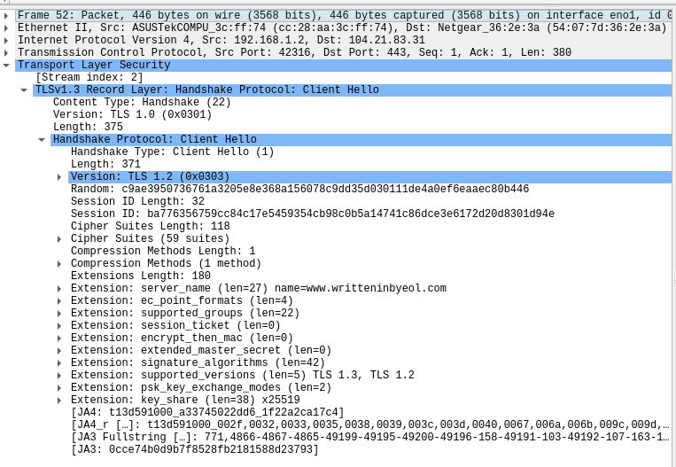

## Public Key Infrastructure
### By Stella Lee

## Tasks
### 1. Host a Local Server

I already have a personal portfolio website at [writteninbyeol.com](https://writteninbyeol.com).  
For the HTTP portion of the assignment, I hosted a local development version by running it on `localhost:3002` (since `localhost:3000` was occupied by a local wiki.js instance). My local development server ran over plain HTTP, while the production version of my site uses HTTPS.  

The production site is hosted on Vercel, with the domain managed through Squarespace, and its TLS certificate was issued by Google Trust Services, which is Google’s Certificate Authority.

### 2. Identify why HTTP is not secure.
When capturing the HTTP part of the assignment, I chose **Loopback: lo** to capture my localhost packets. If you were to see the packet in **Figure 1**, you can see that in the 'Hypertext Transfer Protocol,' you can see the Host I am visiting, what my User Agent is (i.e. what browser, operating system I am using to visit, which although can be spoofed, is compromising to the users who aren't), and also shows what I am talking to, in this case `MathProvider.tsx', a code that I am using to render LaTeX on my website. In this case, it is not too compromising, but had there been a vulnerability with LaTeX or my code, it could be exploited. In addition, it is just fundamentally not secure.

There is:

- no **confidentiality** (every header and url is in plaintext),
- no **integrity** (malicious actors can tamper with the content in transit)
- **information leakage** (reveals the internal code structure, in this case `_next/static/chunks/app_MathProvider_tsx`, which could potentially expose my app's framework or libraries)
- **User fingerprinting** (thru user agents and accept headers)

**Figure 1.** Example of an unencrypted HTTP packet showing request headers and resource path.  

### 3. Create a self-signed certificate and upgrade your web server to HTTPS
When capturing the HTTPS part of the assignment, I chose **eno1** to view traffic over my ethernet. We can see that there is

- **confidentiality** - data is encrypted
- **integrity** - ensured thru TLS handshake
- less **information leakage** - there are still information being leaked by destination ip, SNI (domain name), and size
- **user fingerprinting** - (still remains possible thru metadata, even though cookies or headers themselves are encrypted)

The information in HTTPS is definitely more encrypted and obfuscated compared to HTTP, but there is still information such as what you are browsing that could easily be extracted.

**Figure 2.** Example of an encrypted **HTTPS (TLS 1.3)** packet showing the initial handshake.

